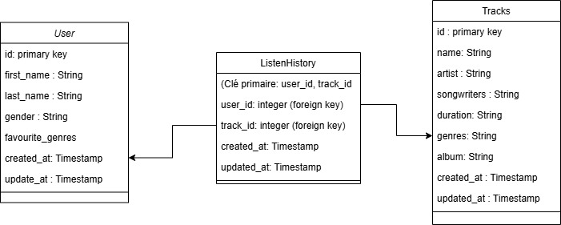
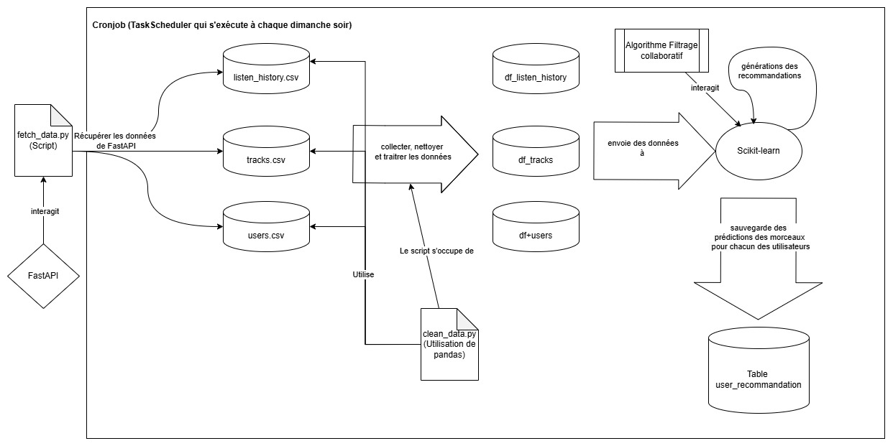

# Réponses du test

## _Utilisation de la solution (étape 1 à 3)_

### **Étape 1 : Création de l'environnement virtuel**
Pour la création de l'environnement virtuel, nous avons fait différentes commandes pour faire le tout.

Nous voulons nous assurer que venv est installé pour pouvoir exécuter la prochaine commande:
```powershell
python -m venv --help
```

Une fois que la commande retourne une aide sur venv, nous pouvons créer notre environnement virtuel avec cette commande:

```powershell
python -m venv venv
```
Cette commande créera un nouveau dossier venv avec plusieurs documents différents. Une fois le document créé, on exécute cette commande.

```powershell
venv\Scripts\activate
```
**Il est possible que par défaut, il y a une politique d’exécution des scripts sous PowerShell, alors Windows bloque l'exécution des fichiers .ps1. Il faut donc autoriser temporairement l'exécution des scripts**

```powershell
Set-ExecutionPolicy Unrestricted -Scope Process
```

Une fois l'environnement virtuelle activé, on peut installer les différents dépendances nécessaires dans le fichier requirements.txt en faisant la commande:
    
```powershell
pip install -r requirements.txt
```


### **Étape 2:**
Pour récupérer quotidiennement les données de l'API, on crée le fichier fetch_data, où nous retrouvons 3 méthodes dans ce script qui va s'exécuter quotidiennement. La première méthode `start_server`, s'assure que le serveur est lancé, et s'il ne l'est pas, on exécute la commande:

```powershell
python -m uvicorn main:app
```

Par la suite, la 2e méthode `fetch_data` récupère les données de FASTAPI en effectuant une requête HTTP GET à l'URL fournie en paramètre. On vérifie si la réponse a un code de statut 200 (succès), si oui, on retourne la liste des éléments dans la réponse JSON. Par contre Si la requête échoue, affiche un message d'erreur avec le code HTTP et retourne une liste vide. La 3e fonction enregistre les données sous forme de fichier CSV dans un dossier nommé datas.
Dans le main, on exécute ces fonctions une à la suite de l'autre pour les 3 différents endpoints qui sont `Users`, `Tracks` et `ListenHistory`.

Nous utilisons `schtasks` pour exécuter le script chaque jour à 08h00 du matin :
```powershell
schtasks /create /tn "FetchAPIData" /tr "/path/to/venv/bin/python /path/to/fetch_data.py" /sc daily /st 08:00
```

**Si nous utilisons Linux/macOS, on exécuterait cette commande:**
```powershell
crontab -e 0 8 * * * /path/to/venv/bin/python /path/to/fetch_data.py
```

Nous pouvons s'assurer que la tâche a bien été créée avec cette commande:

```powershell
schtasks /query /tn "FetchAPIData"
```
Si tout fonctionne correctement, les fichiers CSV seront mis à jour dans le dossier datas. Il faut un serveur toujours actif.


### **Étape 3:**

Pour s'assurer que le pipeline de récupération de données fonctionne correctement, nous avons ajouté des tests unitaires avec `pytest`. On ajoute le module `requests-mock` dans requirements.txt pour simuler des requêtes HTTP pour tester fetch_data sans appeler une vraie API aussi besoin pour les tests.

La commande executé est:

```powershell
pytest test/unit/
```

**Il est possible que la commande ne fonctionne puisque le module moovitamix_fastapi n'est pas reconnu, il est à ce moment nécessaire d'exécuter cette commande:**

```powershell
$env:PYTHONPATH = "$PWD\src"
```

Ainsi, nous avons au total 6 tests unitaires au total:

1. **test_fetch_data_tracks()**
- Vérifier que fetch_data() récupère correctement les données des chansons et respecte le modèle TracksOut

2. **test_fetch_data_users()**
- Vérifier que fetch_data() récupère correctement les données des utilisateurs et respecte le modèle UsersOut.

3. **test_fetch_data_listen_history()**
- Vérifier que fetch_data() récupère l'historique d'écoute et respecte le modèle ListenHistoryOut

4. **test_fetch_data_empty()**
- Vérifier que fetch_data() gère correctement une API renvoyant une liste vide

5. **test_fetch_data_error()**
- Vérifier que fetch_data() gère correctement une erreur HTTP

6. **test_save_to_csv()**
- Vérifier que save_to_csv() crée un fichier CSV valide avec le bon contenu.


Dans le futur, à long terme et dans l'optique d'automatisation, nous aurions la possibilité d'ajouter la configuration pour avoir un pre-commit. Ainsi, à chaque commit, on aura l'automatisation pour tous les tests unitaires. Si l’un des tests échoue, le commit est annulé, obligeant ainsi le développeur à corriger les erreurs avant d’enregistrer ses modifications dans Git. Ainsi, on empêche l’ajout de code cassé dans le dépôt Git et plus besoin d’exécuter manuellement les tests avant chaque commit.


## Questions (étapes 4 à 7)

### **Étape 4:**


Voici mon schéma de base de données que j'utiliserais pour stocker les informations récupérés des trois sources données. La table `Users` possède les différents attributs ainsi qu'une clé primaire qui est le id de chacun des users. Par la suite, la table `Tracks` possède les différents attributs de la chanson ainsi qu'une clé primaire qui est le id. Pour la table `ListenHistory`, elle fait la relation entre `Users` et `Tracks`. La table joue le rôle d'être une table de jointure entre les 2 tables qui est une relation "many-to-many", ce qui veut dire que un utilisateur écoute plusieurs chansons et qu'une chanson est écoutée par plusieurs utilisateurs. Ainsi, comme affiché dans le schéma, on aurait un clé étrangère venant de la table `Users` ainsi qu'une clé étrangère de la Table `Tracks`. La clé primaire sera l'unicité des deux clés étrangères ensemble.

Je recommanderais comme système de base de données PostgreSQL pour ainsi avoir un modèle relationnel qui correspond au schéma. PostgreSQL gère efficacement les jointures complexes et les relations "many-to-many", essentielles pour récupérer les morceaux écoutés par un utilisateur, l’historique, ou les statistiques d’écoute. Aussi, PostgreSQL permet de stocker des listes, JSON et tableaux, utiles si jamais on veut stocker des métadonnées flexibles. Considérant les prochaines étapes où nous voulons avoir un système de recommandation, cette base de données est la meilleure option. De plus, PostgreSQL fonctionne bien avec Python (Pandas, Scikit-learn) et SQL avancé pour des recommandations basées sur l'historique d’écoute.

À long terme, si nous envisageons avoir des gros volumes de donnée, PostgreSQL possède de l'indexation avancé pour une meilleur performance et le partage de charge avec des indexes et partitions pour accélérer les requêtes sur de gros volumes de données.


### **Étape 5:**

Pour assurer un suivi du pipeline de données, nous utilisons `AWS CloudWatch` afin de collecter, analyser et visualiser les métriques essentielles en temps réel. CloudWatch nous permettra de détecter rapidement les anomalies, d'envoyer des alertes automatiques en cas d’échec et d’optimiser la performance du pipeline.

En complément, une table spécifique pipeline_monitoring serait intégrée dans la base de données pour stocker l’historique des exécutions. Cette table enregistre les métriques clés suivantes :

- Disponibilité – Taux de succès (%) : Mesure le pourcentage de jobs exécutés avec succès.
- Fiabilité – Taux d’échec (%) : Indique le pourcentage de jobs ayant échoué, permettant d’identifier les pannes récurrentes.
- Performance – Temps d’exécution (s) : Suivi du temps moyen d’exécution des jobs pour détecter les ralentissements.
- Volume – Nombre de lignes traitées : Permet de repérer des anomalies en identifiant des variations inattendues du volume de données ingérées.

### **Étape 6**


Pour automatiser le calcul de recommandation, ma solution serait d'avoir un pipeline qui fera un traitement de données et un système de recommandation. Par le schéma, le script fetch_data.py récupère les données depuis une API FastAPI et les stocke sous forme de fichiers CSV. Ensuite, clean_data.py, en utilisant Pandas, nettoie et transforme ces données pour les rendre utilisables. Cela veut dire que le script s'occupe du filtrage des valeurs manquantes, de la normalisation et de la préparation des features.

Par la suite, on aura la génération des recommandations avec un algorithme de recommandation basé sur le filtrage collaboratif. À cette étape, nous utiliserons Scikit-learn. Une fois que la prédiction des morceaux pour chaque utilisateur est réalisé, nous voulons sauvegarder les recommandations dans une table de user_recommandation avec la base données mentionné plus haut, PostgreSQL. Nous utiliserons task scheduler, schtasks, pour s'assurer quee le tout s'exécute hebdomadairement à chaque dimanche soir. 

### **Étape 7**

Pour automatiser le réentraînement du modèle de recommandation, il est essentiel de mettre en place un pipeline automatisé qui gère l'extraction des nouvelles interactions utilisateur-chanson, le prétraitement des données et la mise à jour du modèle. On aurait l'implémentation d'un job via **AWS Lambda** afin d’exécuter le réentraînement du modèle à une fréquence définie, comme une fois par semaine. On utilise aussi **AWS Step Functions** permettant d'avoir plusieurs tâches dans un flux de travail et par **AWS CloudWatch Events** qui va nous permettre de planifier des exécutions périodiques. En première étape, nous ferions l'extraction des nouvelles données des 3 endpoints et effectuerons un nettoyage et un formatage des données pour garantir leur qualité. Ensuite, Une fois ces données préparées, elles seront utilisées pour réentraîner le modèle en utilisant **Scikit-learn**. La performance du nouveau modèle sera comparée à celle du modèle précédent afin de s’assurer qu’il apporte une meilleure précision. Si le modèle réentraîné est plus performant, il sera automatiquement déployé pour remplacer l'ancien modèle en production, garantissant ainsi des recommandations optimisées et à jour pour les utilisateurs. Dans le cas où le modèle n'est pas plus performant, un message serait automatiquement envoyé à l'équipe pour avertir la situation.